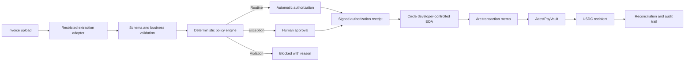

# AttestPay

> Every payment proves why it was allowed.

AttestPay is a policy-controlled treasury agent that evaluates invoices,
verified vendors, work orders, and spending rules before USDC can move. Routine
payments can execute automatically; duplicates, recipient changes, unusual
amounts, and policy violations are blocked or escalated for human approval.

The hackathon prototype targets the **Agentic Economy Track** and uses a Circle
developer-controlled wallet on **Arc Public Testnet**.

> [!IMPORTANT]
> AttestPay is an early testnet prototype. It is not production-ready financial,
> custody, audit, or compliance infrastructure and must not be used with real
> funds.

## Why AttestPay

An AI system can extract facts from an invoice, but it should not have
unrestricted authority to move money. AttestPay separates those responsibilities:

- AI extracts and explains invoice information.
- Deterministic code evaluates payment policy.
- A human approves defined exceptions.
- An onchain vault enforces the final payment boundary.
- Every decision produces an authorization receipt linked to its Arc transaction.

The product is not another invoice OCR demo. Its core contribution is a
verifiable authorization boundary between an AI-proposed action and an
irreversible payment.

## Example Decision

Suppose a verified design contractor submits a 500 USDC invoice against an
approved work order:

1. AttestPay extracts the vendor, amount, invoice number, and wallet address.
2. The policy engine confirms the invoice is new, the work order matches, and
   the recipient is the vendor's verified wallet.
3. Because 500 USDC is inside the configured automatic-payment limit, the
   decision becomes `AUTO_APPROVED`.
4. AttestPay creates an authorization receipt and submits the payment through
   Circle on Arc Testnet.

If the same invoice is uploaded again, it becomes `BLOCKED_DUPLICATE`. If its
wallet address changes, it becomes `BLOCKED_RECIPIENT_MISMATCH`. If the amount
exceeds the automatic limit, it becomes `REVIEW_REQUIRED`.

This is similar to a company expense policy: software can prepare the payment,
but it cannot invent its own spending authority.

## Planned Architecture



### Why an EOA?

The prototype uses an externally owned account (EOA) because Arc transaction
memos require the EOA to be the direct caller. The memo links a payment to its
authorization receipt without putting the raw invoice or private vendor data
onchain.

## Current Build Status

**Milestone 0 — Technical spike: in progress**

| Capability | Status |
| --- | --- |
| Node.js project and Circle SDK | Complete |
| Testnet API key and entity-secret registration workflow | Complete |
| Recovery-file generation and local safety checks | Complete |
| Circle wallet set | Next |
| Circle EOA on `ARC-TESTNET` | Not started |
| Testnet funding and basic USDC transfer | Not started |
| Arc memo compatibility spike | Not started |
| `AttestPayVault` contract | Not started |
| Policy engine, API, database, and UI | Not started |

The immediate goal is to prove the critical external path before building the
full interface:

```text
Circle wallet -> Arc EOA -> transaction memo -> AttestPayVault -> test USDC recipient
```

## Repository Structure

```text
attestpay/
├── scripts/
│   └── circle/
│       ├── generate-entity-secret.mjs
│       └── register-entity-secret.mjs
├── .env.example
├── .gitignore
├── package.json
└── README.md
```

The structure will expand as the wallet adapter, smart contract, policy engine,
web application, and tests are implemented.

## Local Setup

### Prerequisites

- Node.js 22.6 or newer
- npm
- A Circle Testnet server-side API key
- An encrypted location for the entity secret and recovery file

### Install

```bash
npm install
```

Create the local environment file:

```bash
cp .env.example .env.local
```

Generate an entity secret without printing it to the terminal:

```bash
npm run circle:generate-secret
```

Add the Testnet API key to `.env.local`:

```dotenv
CIRCLE_API_KEY=TEST_API_KEY:replace_with_your_key
CIRCLE_ENTITY_SECRET=generated_locally_by_the_previous_command
```

Register the entity secret once:

```bash
npm run circle:register-secret
```

The registration command validates the Testnet API key and entity-secret
format, refuses to overwrite existing recovery material, and verifies that
Circle produced one recovery file.

Do not repeat registration after it succeeds. Store the generated recovery
file outside the repository.

## Available Commands

| Command | Purpose |
| --- | --- |
| `npm run circle:generate-secret` | Generate an entity secret and store it in `.env.local` without printing it |
| `npm run circle:register-secret` | Register the entity secret with Circle and create recovery material |

## Security Model

- Uploaded invoices and extracted model output are untrusted inputs.
- AI output cannot directly authorize or execute a payment.
- Vendor wallet addresses must be independently verified.
- Duplicate invoices and reused authorization receipts must be rejected.
- Human approval must bind to the exact recipient, amount, asset, invoice, and
  policy version.
- The onchain vault independently enforces recipient and spending constraints.
- Raw invoices, API keys, entity secrets, private keys, and recovery files must
  never be committed or placed onchain.

The repository ignores `.env.local`, `recovery/`, and `node_modules/`. The
committed `.env.example` contains variable names only.

## MVP Demo Scenarios

1. **Routine invoice:** passes every rule and pays automatically.
2. **Duplicate invoice:** is blocked before a transaction is created.
3. **Recipient substitution:** is blocked because the wallet differs from the
   verified vendor record.
4. **Unusual amount:** requires human approval bound to the exact payment.

## Delivery Roadmap

1. **Technical spike** — prove Circle wallet, Arc memo, vault, and test USDC
   compatibility.
2. **Decision core** — implement vendors, work orders, invoice hashing,
   deterministic policies, and authorization receipts.
3. **Controlled execution** — deploy the vault, add bound approvals, submit
   through Circle, and reconcile Arc events.
4. **Product workflow** — build the authenticated operator and approver UI.
5. **Submission hardening** — adversarial tests, clean setup validation,
   documentation, and a three-minute demo.

## Planned Technology

- Next.js, TypeScript, React, and Tailwind CSS
- PostgreSQL with migration-managed schema
- Zod for strict input validation
- Circle developer-controlled wallet SDK
- `viem` for Arc contract and event interaction
- Solidity with contract tests
- Playwright for end-to-end browser verification

Technology choices beyond the installed Circle SDK remain proposed until their
implementation milestone begins.

## Official References

- [Arc documentation](https://docs.arc.io/)
- [Arc transaction memos](https://docs.arc.io/arc/concepts/transaction-memos)
- [Circle developer-controlled wallets](https://developers.circle.com/wallets/dev-controlled)
- [Circle Wallets supported blockchains](https://developers.circle.com/wallets/supported-blockchains)

## License

No open-source license has been selected yet. All rights are reserved unless a
license file is added.
