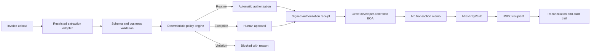

# AttestPay

> Every payment proves why it was allowed.

AttestPay is a policy-controlled treasury agent that evaluates invoices,
verified vendors, work orders, and spending rules before USDC can move. Routine
payments can execute automatically; duplicates, recipient changes, unusual
amounts, and policy violations are blocked or escalated for human approval.

The initial implementation uses a Circle developer-controlled wallet on
**Arc Public Testnet**.

> [!IMPORTANT]
> AttestPay is an early testnet prototype. It is not production-ready financial,
> custody, audit, or compliance infrastructure and must not be used with real
> funds.

## Why AttestPay

An AI system can extract facts from an invoice, but it should not have
unrestricted authority to move money. AttestPay separates those responsibilities:

- AI extracts and explains invoice information.
- Deterministic code evaluates payment policy.
- A human approves defined exceptions.
- An onchain vault enforces the final payment boundary.
- Every authorized payment produces a receipt that can later be linked to its
  Arc transaction; blocked and pending-review decisions cannot authorize funds.

The product is not another invoice OCR demo. Its core contribution is a
verifiable authorization boundary between an AI-proposed action and an
irreversible payment.

## Example Decision

Suppose a verified design contractor submits a 500 USDC invoice against an
approved work order:

1. AttestPay extracts the vendor, amount, invoice number, and wallet address.
2. The policy engine confirms the invoice is new, the work order matches, and
   the recipient is the vendor's verified wallet.
3. Because 500 USDC is inside the configured automatic-payment limit, the
   decision becomes `AUTO_APPROVED`.
4. AttestPay creates an authorization receipt and submits the payment through
   Circle on Arc Testnet.

If the same invoice is uploaded again, it becomes `BLOCKED` with stable
duplicate reason codes. If its wallet address changes, it becomes `BLOCKED`
with `RECIPIENT_MISMATCH`. If the amount exceeds the automatic limit while
remaining inside the work order, it becomes `NEEDS_REVIEW`.

This is similar to a company expense policy: software can prepare the payment,
but it cannot invent its own spending authority.

## Planned Architecture

The detailed dependency rules and module boundaries are recorded in
[docs/architecture.md](docs/architecture.md). Repository-wide implementation
requirements are defined in
[docs/engineering-standards.md](docs/engineering-standards.md).



### Why an EOA?

The prototype uses an externally owned account (EOA) because Arc transaction
memos require the EOA to be the direct caller. The memo links a payment to its
authorization receipt without putting the raw invoice or private vendor data
onchain.

## Current Build Status

**Technical foundation complete; local controlled path verified with fake adapters**

| Capability | Status |
| --- | --- |
| Node.js project and Circle SDK | Complete |
| Strict TypeScript configuration and type-check command | Complete |
| Testnet API key and entity-secret registration workflow | Complete |
| Recovery-file generation and local safety checks | Complete |
| Circle wallet set and `ARC-TESTNET` EOA | Complete |
| Typed treasury port, Circle adapter, balance use case, and unit tests | Complete |
| Live Circle wallet and balance verification | Complete |
| Testnet funding and canonical USDC balance | Complete |
| Controlled recipient and idempotent USDC transfer path | Live verified |
| Independent Arc receipt and USDC event reconciliation | Complete |
| Arc memo encoding, Circle submission, and event reconciliation | Live verified |
| `AttestPayVault` contract, adversarial tests, and Arc deployment | Live verified |
| Vault recipient approval, funding, signed execution, and multi-event reconciliation | Live verified |
| Canonical vendor, verified-wallet, and fail-closed verification model | Complete |
| Canonical work-order, USDC balance, status, and validity model | Complete |
| Canonical invoice normalization, raw SHA-256, and semantic fingerprint | Complete |
| Versioned policy-definition, policy-input, and ordered decision hashing | Complete |
| Deterministic policy-engine core and offline scenario tests | Complete |
| Canonical authorization receipt hashing, local signing, recovery, expiry, context, and replay verification | Complete offline slice |
| Explicit invoice and payment lifecycle transition guards | Complete |
| Transactional SQLite workflow, audit-event, and replay persistence | Complete local slice |
| Bearer-protected operations API and browser workflow | Complete local slice |
| Authoritative Arc chain, configured vault, and canonical USDC enforcement | Complete local slice |
| Server-derived configured local operator attribution | Complete local slice |
| Receipt-to-vault authorization derivation and settlement orchestration | Verified with local adapters |
| Retry-safe `SUBMITTED` settlement reconciliation without resubmission | Verified with local adapters |
| Live execution of a product-created receipt | Not yet performed |
| OCR/extraction and deployment-grade identity/PostgreSQL | Not started |

The critical external path is live-verified on Arc Public Testnet:

```text
Circle wallet -> Arc EOA -> transaction memo -> AttestPayVault -> test USDC recipient
```

Milestones 1A and 1B are complete. Canonical business records feed deterministic
policy hashes, and a versioned authorization receipt now binds those hashes to
one exact Arc payment intent. Local tests create EIP-712 signatures with
deterministic test-only accounts, recover the signer, enforce expiry and expected
execution context, and consume an authority-scoped replay key once.

The local workflow now persists decisions, approvals, receipts, replay keys,
prepared vault calls, provider state, settlement evidence, and ordered audit
events in SQLite. The browser and bearer-protected API operate that state, and
tests prove the receipt-to-vault-to-settlement sequence without calling Circle.
Authorization, execution, and reconciliation reject any workflow or receipt that
does not match the server-owned Arc chain, configured vault, and canonical Arc
USDC address. OCR/extraction, deployment-grade identity and PostgreSQL, and a
live execution of this new product path remain unfinished.

### Canonical authorization receipt

The `attestpay.authorization-receipt.v1` payload uses fixed field order and
unambiguous base-10 encoding for integer values. Its SHA-256 receipt hash binds
the receipt schema, decision hash, policy-definition hash, policy-input hash,
authorization outcome, authorizer, Arc chain ID, vault, recipient, USDC token,
base-unit amount, payment reference, nonce, issue time, and expiry time.

The EIP-712 signature binds the same fields and embeds the canonical receipt
hash. Its domain independently binds the chain ID and vault. Verification is
local: it validates canonical form and the expected payment context, rejects
not-yet-valid or expired receipts, recovers the signer, compares EVM identities
canonically, and atomically consumes a replay key scoped to the authorizer,
chain, vault, and nonce. Any replay-store failure denies authorization.

### Local product workflow

The operations server exposes the workflow queue and audit evidence while all
state transitions remain backend-enforced. `RECEIVED -> VALIDATED -> EVALUATED`
is the explicit invoice sequence. Payment decisions begin as `AUTO_APPROVED`,
`AWAITING_HUMAN_APPROVAL`, or `BLOCKED`; only a valid human approval or automatic
decision can reach `AUTHORIZED`, then `SUBMITTED`, and finally `SETTLED` after
independent Arc evidence. Invalid skips and repeated terminal transitions fail.
If settlement verification encounters a transient RPC failure after submission,
the workflow stays `SUBMITTED` with its original transaction and prepared-call
evidence. Retrying runs reconciliation only: it cannot request either signature,
prepare a replacement payment, or call the submission adapter again. Optimistic
versions allow only one concurrent reconciliation to persist `SETTLED` and its
single ordered audit event.

SQLite uses one migration and transactions with optimistic workflow versions.
Receipt verification consumes the unique replay key in the same transaction
that persists the `AUTHORIZED` state and audit event. The store survives process
restart; Node currently labels its built-in SQLite module experimental.

The product receipt is translated into the deployed vault's narrower EIP-712
instruction. The vault `invoiceHash` binds the policy-input hash and its
`policyHash` is the complete canonical receipt hash, so the vault signature and
settlement event transitively bind the full offchain decision evidence.

The shared bearer token authenticates one local operations boundary. Approve
and reject requests contain no caller-asserted identity or approval ID; the
server records the validated `ATTESTPAY_OPERATOR_ID` and generates the approval
ID from trusted workflow, version, operator, and decision data. This is a
configured local operator identity, not verified individual human identity.
Users, sessions, roles, and per-user attribution remain unimplemented.

The verified Arc Testnet contract address, deployment transaction, authorities,
and initial limits are recorded in [docs/deployments.md](docs/deployments.md).

## Repository Structure

```text
attestpay/
├── docs/
│   ├── architecture.md
│   └── engineering-standards.md
├── src/
│   ├── application/
│   │   ├── ports/
│   │   └── use-cases/
│   ├── config/
│   ├── domain/
│   │   ├── invoices/
│   │   ├── payments/
│   │   ├── policies/
│   │   ├── treasury/
│   │   ├── vendors/
│   │   └── work-orders/
│   ├── infrastructure/
│   │   ├── arc/
│   │   ├── circle/
│   │   └── local/
│   └── interfaces/
│       └── cli/
├── scripts/
│   └── circle/
│       ├── create-treasury-wallet.ts
│       ├── generate-entity-secret.ts
│       └── register-entity-secret.ts
├── .env.example
├── .gitattributes
├── .gitignore
├── package.json
├── tests/
│   └── unit/
├── tsconfig.json
└── README.md
```

The structure will expand as receipt signing, persistence, the product API,
web application, and their tests are implemented.

## Local Setup

### Prerequisites

- Node.js 22.6 or newer
- npm
- TypeScript tooling is installed locally through the project
- A Circle Testnet server-side API key
- An encrypted location for the entity secret and recovery file

### Install

```bash
npm install
```

### Run the local operations workflow

Provide the public demo authorizer, vault, and recipient addresses as process
environment variables, then seed the four scenarios through the real canonical
policy engine:

```text
ATTESTPAY_DEMO_AUTHORIZER_ADDRESS
ATTESTPAY_DEMO_VAULT_ADDRESS
ATTESTPAY_DEMO_RECIPIENT_ADDRESS
ATTESTPAY_DATABASE_PATH (optional; defaults to local-state/attestpay.sqlite)
```

```bash
npm run app:seed
```

Set a stable `ATTESTPAY_OPERATOR_ID` and a strong `ATTESTPAY_OPERATOR_TOKEN`
through the local process environment, then start the backend on `127.0.0.1`.
The ID labels the one configured local operator; it does not establish a
deployment-grade user identity:

```bash
npm run app:start
```

Open `http://127.0.0.1:3100`, choose **Connect**, and enter that operator token.
The token is kept in browser `sessionStorage`; wallet credentials remain on the
backend. The server does not automatically load `.env.local`.

The **Submit & verify settlement** action is an explicit Arc Testnet mutation.
Use it only after reviewing the exact authorized recipient, amount, hashes, and
vault, and only with deliberately small test funds. Seeding, browsing, approval,
and automated tests do not submit a payment. A `SUBMITTED` workflow instead
shows **Retry settlement verification**, which reconciles the persisted original
transaction without another signature or submission.

Create the local environment file:

```bash
cp .env.example .env.local
```

Generate an entity secret without printing it to the terminal:

```bash
npm run circle:generate-secret
```

Add the Testnet API key to `.env.local`:

```dotenv
CIRCLE_API_KEY=TEST_API_KEY:replace_with_your_key
CIRCLE_ENTITY_SECRET=generated_locally_by_the_previous_command
```

Register the entity secret once:

```bash
npm run circle:register-secret
```

The registration command validates the Testnet API key and entity-secret
format, refuses to overwrite existing recovery material, and verifies that
Circle produced one recovery file.

Do not repeat registration after it succeeds. Store the generated recovery
file outside the repository.

Create or verify the AttestPay Treasury wallet set and Arc Testnet EOA:

```bash
npm run circle:create-wallet
```

The command stores the returned wallet-set ID, wallet ID, and public wallet
address in `.env.local`. It persists Circle idempotency keys before making each
creation request, allowing the same operation to be retried safely after a
timeout without intentionally creating duplicate resources.

Create or verify a separate Circle-controlled Arc Testnet recipient:

```bash
npm run circle:create-recipient
```

Create or verify a separate Circle-controlled authorization signer. This wallet
signs EIP-712 payment instructions but cannot execute them:

```bash
npm run circle:create-authorizer
```

Compile, deploy, poll, and independently verify `AttestPayVault` on Arc Testnet:

```bash
npm run contract:deploy-vault
```

The deployment command uses Circle Contracts with the existing treasury EOA,
persists its idempotency key before submission, and verifies the deployed
bytecode, canonical Arc USDC address, role assignments, administrator, and
spending limits through an independent Arc RPC read.

Approve the controlled test recipient through the vault administrator:

```bash
npm run vault:approve-recipient -- approve-recipient-001
```

Fund the vault with a deliberately small amount of test USDC:

```bash
npm run vault:fund -- vault-funding-001 1
```

Create, sign, execute, and reconcile one vault-controlled test payment:

```bash
npm run vault:send-test -- vault-payment-001 0.01 invoice-001 policy-v1
```

The payment command persists one immutable authorization before submission.
The operation ID controls retries; the invoice and policy references are hashed
before they reach Arc. Settlement is accepted only when the receipt contains
the ordered `BeforeMemo -> Transfer -> PaymentExecuted -> Memo` evidence with
the exact expected vault, executor, authorizer, recipient, amount, and hashes.

Submit a deliberately small transfer by assigning it a stable operation ID:

```bash
npm run circle:send-test -- first-transfer 0.01
```

The command persists the exact payload and Circle idempotency key under the
ignored `local-state/` directory before submitting. Repeating the same command
resumes the same Circle transaction; reusing the operation ID with a different
amount or recipient fails closed. After Circle returns a transaction hash, the
command independently reads the Arc receipt and accepts settlement only when a
successful receipt contains the exact expected USDC sender, recipient, and
amount event.

Submit a small memo-linked transfer with separate operation and authorization
references:

```bash
npm run circle:send-memo-test -- memo-transfer-001 0.01 auth-001
```

The operation ID controls safe retries. The authorization reference identifies
the offchain approval record. AttestPay hashes the authorization reference into
a 32-byte `memoId`; it does not publish the invoice, vendor details, approval
notes, or other private business data. Settlement requires the ordered Arc
events `BeforeMemo -> Transfer -> Memo` to match the expected payment.

## Available Commands

| Command | Purpose |
| --- | --- |
| `npm run typecheck` | Run strict TypeScript validation without generating build files |
| `npm test` | Run unit tests through Node's test runner and `tsx` |
| `npm run test:contract` | Run Solidity authorization, replay, limit, pause, and fuzz tests |
| `npm run test:all` | Run TypeScript and Solidity test suites |
| `npm run app:seed` | Persist four deterministic policy scenarios in the local SQLite store |
| `npm run app:start` | Start the bearer-protected local operations API and browser UI |
| `npm run contract:compile` | Compile the Solidity contracts with Hardhat |
| `npm run circle:generate-secret` | Generate an entity secret and store it in `.env.local` without printing it |
| `npm run circle:register-secret` | Register the entity secret with Circle and create recovery material |
| `npm run circle:create-wallet` | Create or verify the AttestPay wallet set and `ARC-TESTNET` EOA |
| `npm run circle:create-recipient` | Create or verify the controlled Arc Testnet recipient |
| `npm run circle:create-authorizer` | Create or verify the separate EIP-712 authorization signer |
| `npm run circle:balances` | Validate the configured treasury and list Circle-indexed balances |
| `npm run circle:send-test -- <operation-id> <amount>` | Submit or resume one idempotent controlled USDC transfer |
| `npm run circle:send-memo-test -- <operation-id> <amount> <authorization-reference>` | Submit, resume, and reconcile one memo-linked USDC transfer |
| `npm run vault:approve-recipient -- <operation-id>` | Approve and independently verify the controlled recipient through the vault |
| `npm run vault:status` | Read the live vault balance, pause state, recipient approval, limits, and daily spend from Arc |
| `npm run vault:fund -- <operation-id> <amount>` | Fund the vault and verify the exact canonical USDC transfer |
| `npm run vault:send-test -- <operation-id> <amount> <invoice-reference> <policy-reference>` | Sign, submit, and reconcile one policy-bound vault payment |
| `npm run contract:deploy-vault` | Compile, idempotently deploy, and independently verify `AttestPayVault` |

## Security Model

- Uploaded invoices and extracted model output are untrusted inputs.
- AI output cannot directly authorize or execute a payment.
- Vendor wallet addresses must be independently verified.
- Duplicate invoices and reused authorization receipts must be rejected.
- The vault, not the executor EOA, holds the budget protected by onchain policy.
- A separate authorizer signs the exact EIP-712 payment payload; the executor
  can submit that payload but cannot modify it.
- The product receipt binds the exact decision evidence and payment intent;
  verification rejects cross-chain, cross-vault, cross-token, cross-recipient,
  amount, nonce, and decision-context reuse.
- Replay protection is consumed transactionally with the authorized workflow
  and audit event in SQLite; a unique replay key rejects concurrent reuse.
- Authorization, vault signing, calldata preparation, submission, and retry
  reconciliation are pinned to the configured Arc chain, vault, and USDC token.
- Browser JSON cannot choose the approval audit principal; the server records
  the configured local operator ID, which is not deployment-grade human identity.
- A settlement-verifier outage leaves the original submission retryable and
  never authorizes a replacement signature or payment submission.
- Human approval must bind to the exact recipient, amount, asset, invoice, and
  policy version.
- The onchain vault independently enforces recipient and spending constraints.
- Raw invoices, API keys, entity secrets, private keys, and recovery files must
  never be committed or placed onchain.

The repository ignores `.env.local`, `recovery/`, and `node_modules/`. The
committed `.env.example` contains variable names only.

## MVP Demo Scenarios

1. **Routine invoice:** passes every rule and pays automatically.
2. **Duplicate invoice:** is blocked before a transaction is created.
3. **Recipient substitution:** is blocked because the wallet differs from the
   verified vendor record.
4. **Unusual amount:** requires human approval bound to the exact payment.

## Delivery Roadmap

1. **Technical spike** — prove Circle wallet, Arc memo, vault, and test USDC
   compatibility.
2. **Decision core** — canonical vendors, work orders, invoice hashing, and
   deterministic decisions and locally verified authorization receipts are complete.
3. **Controlled execution** — deploy the vault, add bound approvals, submit
   through Circle, and reconcile Arc events.
4. **Product workflow** — build the authenticated operator and approver UI.
5. **Product hardening** — adversarial tests, clean setup validation,
   documentation, and a repeatable product demo.

## Planned Technology

| Area | Language and technology |
| --- | --- |
| Web interface | TypeScript, Next.js, React, and Tailwind CSS |
| Backend and deterministic policy | Strict TypeScript with Zod validation |
| Circle wallet integration | TypeScript and the official Circle developer-controlled wallet SDK |
| Arc integration | TypeScript and `viem` |
| Onchain vault | Solidity, OpenZeppelin Contracts, and Hardhat 3 |
| Persistence | PostgreSQL with migration-managed SQL and an ORM |
| Browser verification | Playwright |

Circle and Arc are platforms rather than programming languages. TypeScript owns
the offchain system, Solidity owns the EVM contract, and SQL owns persistent
data definitions.

The Circle SDK and `viem` are installed and exercised by live integration
paths. Remaining technologies stay proposed until their implementation
milestone begins.

## Official References

- [Arc documentation](https://docs.arc.io/)
- [Arc transaction memos](https://docs.arc.io/arc/concepts/transaction-memos)
- [Circle developer-controlled wallets](https://developers.circle.com/wallets/dev-controlled)
- [Circle Wallets supported blockchains](https://developers.circle.com/wallets/supported-blockchains)
- [Circle custom contract deployment](https://developers.circle.com/contracts/scp-deploy-smart-contract)
- [OpenZeppelin Contracts](https://docs.openzeppelin.com/contracts/5.x/)
- [Hardhat 3 Solidity testing](https://hardhat.org/docs/guides/testing/using-solidity)

## License

No open-source license has been selected yet. All rights are reserved unless a
license file is added.
